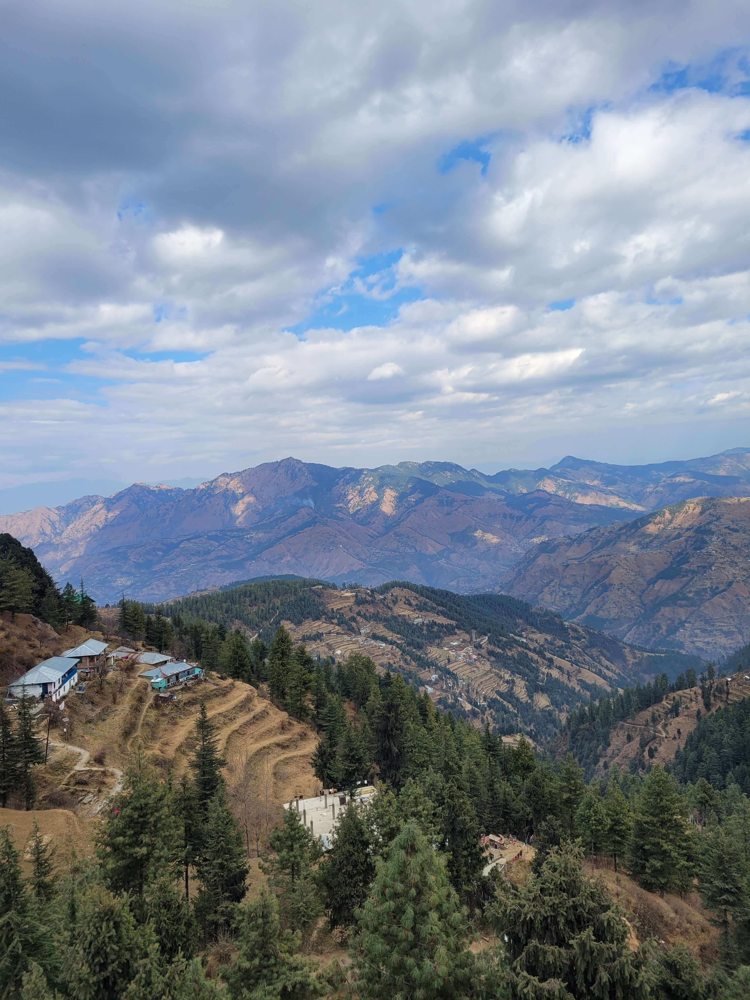

import { Image } from 'astro:assets'
import BlogPostHeading from '../../components/BlogPostHeading.astro'
import ShimlaImage from '../../assets/Shimla.jpg'

<BlogPostHeading title={frontmatter.title} />

<Image src={ShimlaImage.src} alt={frontmatter.image.alt} />
Shimla offers much more than charming colonial buildings against a backdrop of the magnificent snow-capped Himalayas.
Much more than the dozens of Bollywood songs set on Mall Road or its oldest boarding schools. 
The upper reaches around the Shimla region offer skating on natural ice as well as host the MTB Himalaya
(South East Asia’s biggest mountain biking race). Shimla also boasts ownership of the 16th century “Arya Astha Sahasrikas Prajna Paramita” 
Tibetan script (at the quaint Maria Brothers antique booksellers) and the Jakhu Temple Shrine with Lord Hanuman’s footprints.
  
Originally part of the Kingdom of Nepal (before it was declared the British Summer Capital of India), pleasant summers and snow-covered winters make Shimla a favorite weekend getaway with tourists all year-round. Expect a tattoo artist around every corner, but expect no food after midnight. Legendary ghost stories (Chudail Baudi, for single men whose cars slow down for the lady in the white sari) and fantastic cultural heritage make this visit all the more memorable. un[travel] your way up that UNESCO heritage railway route to Shimla for sights and sounds like never before.
Shimla has a lot of stories to tell, some legends, and more heritage, but all equally exciting.
  
Begins at the appropriately named ‘Scandal Point’ where legend has it that the Maharajah of Patiala was exiled from Shimla after a fierce argument with the Viceroy (some stories say he eloped with the Viceroy’s daughter) and was eventually exiled from Shimla –giving this spot its name in 1892. Send yourself a postcard from the timber-structured ‘wild west Swiss’-styled 133-year-old Shimla General Post Office as a souvenir.
  

Pass Christ Church on the ridge that was built back in 1857 with its tower clock and fresco designed by Rudyard Kipling’s father. Take a break at The Town Hall’s steps, but make way for officials as it’s still used by the Municipal Corporation of Shimla. Get transported to the grandeur and aura of times gone by at the century-old Gaiety Theatre before you move on to the ancient Kali Bari Temple. Stop for a breather at the neo-Gothic Gorton Castle set in the midst of gigantic Deodars. Walk past the enormous Vidhan Sabha to the old Victorian mansion that now houses the Himachal State Museum with its numerous cultural treasures. Be prepared for a pleasant colonial hangover at the end of this walk.

